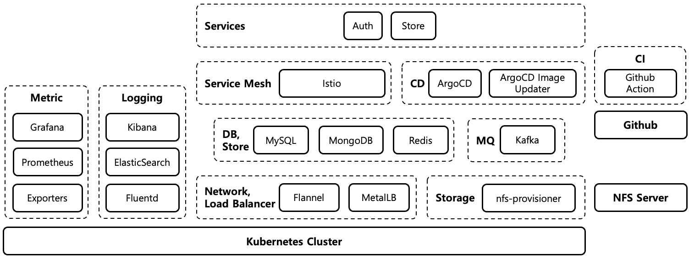

# msa-event-market

**msa-event-market** is an e-ecommerce toy project for personal study. msa-event-market aims to build as an **MSA (Micro Service Architecture)** and **EDA (Event-Driven Architecture)** based on **K8s** ([Kubernetes](https://kubernetes.io/)). msa-event-market services are deployed, operated, and monitored on K8s cluster. In addition, DB, message queue, cache, proxy, log analyzer/collector, metric collector, and CI/CD tool used by msa-event-market services also operate on K8s cluster.

## Component Stack

msa-event-market project's component stack

## GIT Repositories

msa-event-market project is composed of the following git repositories.

* [service-auth](https://github.com/ssup2-playground/msa-event-market_service-auth) : Auth service manages user information and is responsible for authentication/authorization of msa-event-market service. Auth service is developed with **Golang**.

* [service-store](https://github.com/ssup2-playground/msa-event-market_service-store) : Store service manages store and product inventory. Store service is developed with **Java on SpringBoot**.

* service-order : Todo

* service-payment : Todo

* service-web : Todo

* [deploy-services](https://github.com/ssup2-playground/msa-event-market_deploy-services) : Service deployment configuration git repository for GitOps.

* [helm-charts](https://github.com/ssup2-playground/helm-charts) : Helm charts of DB, message queue, cache, proxy, log analyzer/collector, metric collector, and CI/CD tool used by msa-event-market services.

## Service Considerations

The following considerations are reflected in msa-event-market services.

* **Architecture** - Each msa-event-market service follows the [clean architecture](https://blog.cleancoder.com/uncle-bob/2012/08/13/the-clean-architecture.html). 

* **Service mesh** - msa-event-market services run on service mesh for detailed traffic control and easy monitoring. Service mesh is applied through [Istio](https://istio.io/). Istio uses [OpenTracing](https://opentracing.io/) for easy request tracing between multiple services.

* **Event-driven architecture** - msa-event-market services use event-driven architecture for loose coupling and asynchronous processing. [Kafka](https://kafka.apache.org/) is used as the event of msa-event-market services.

* **Transaction pattern** - msa-event-market services use [saga pattern](https://microservices.io/patterns/data/saga.html) and [outbox pattern](https://microservices.io/patterns/data/transactional-outbox.html) for stable transaction processing with [debezium outbox router](https://debezium.io/documentation/reference/1.8/transformations/outbox-event-router.html).

* **API** - msa-event-market services support **HTTP** and **gRPC** as APIs. HTTP API is provided for external clients, and gRPC API is provided for use between msa-event-market services. HTTP API is exposed through [OpenAPI 3.0](https://www.openapis.org/) and swagger. GRPC API supports reflection to discover services.

* **Healthz endpoint** - msa-event-market services supports the "/healthz" endpoint that can check the operating status of the service. The "/healthz" endpoint is used when configuring the liveness/readiness probe on K8s cluster.

* **Gracefully shutdown** - msa-event-market services supports gracefully shutdown to minimize deployment impact. K8s sends **SIGTERM** signal to notify the app of termination before the app termination. Therefore, when msa-event-market services receive a sigterm signal, they terminate the service gracefully.

* **Log** - msa-event-market services output the log in **plain text** format for easy debugging in a personal development environment, and output the log in **JSON** format for easy parsing when operating in K8s Cluster. Logs of msa-event-market services are collected by [Fluentd](https://www.fluentd.org/) and stored in [Elastic Search](https://www.elastic.co/elasticsearch/). All request related logs output TraceID based on OpenTracing to make it easy to trace the request.

* **Metric** - Metrics of msa-event-market services are collected through [Prometheus](https://prometheus.io/) and exporter, and visualized through [Grafana](https://grafana.com/).

* **CI/CD** - msa-event-market services use CI/CD for stable service distribution. CI (Continuous Integration) is performed through [Github Actions](https://github.com/features/actions) and CD (Continuous Deployment) is performed through [ArgoCD](https://argo-cd.readthedocs.io/en/stable/).

